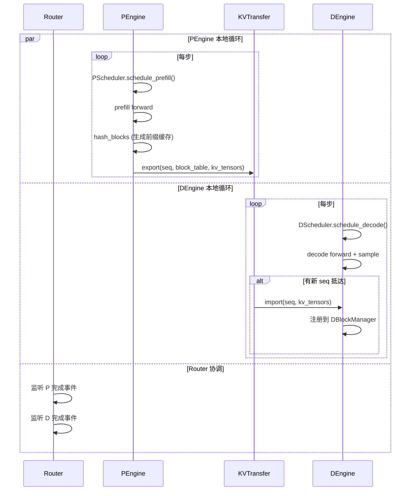

# Nano-vLLM 增加 PD 分离（Prefill/Decode Disaggregation）实现方案

> **任务目标**：在保持 nano-vllm 极简风格的前提下，为其增加 Prefill 与 Decode 分离的能力，让 Prefill 与 Decode 跑在不同的进程/GPU 上，通过 KV Cache 跨节点/跨进程传输完成衔接。
>
> **起始时间**：2026-06-30 23:15

---

## 章节清单

- [ ] 
- [ ] 
- [ ] 
- [ ] 
- [ ] 
- [ ] 
- [ ] 
- [ ] 
- [ ] 

---

## 0. 背景与目标对齐

### 0.1 为什么要 PD 分离

Prefill 与 Decode 的硬件偏好天然冲突：

| 阶段              | 计算特征                            | 瓶颈               | 适合的硬件                        |
| ----------------- | ----------------------------------- | ------------------ | --------------------------------- |
| **Prefill** | 大 batch、长 seq、矩阵乘密集        | 算力 (FLOPS)       | 大算力 GPU（H100/A100）           |
| **Decode**  | 小 batch、单 token、KV cache 反复读 | **显存带宽** | 显存带宽高、算力可低（L40S 也行） |

混合调度时，Prefill 一上来就把 SM 吃满，导致 Decode 请求的 TBT (Time Between Tokens) 暴涨，**首 token 延迟和持续吐字速度互相打架**。PD 分离的核心收益：

1. **TTFT（首 token 延迟）可控**：P 端专心算 prefill，不被 decode 打断。
2. **TBT 平稳**：D 端无需被新 prefill 抢占，持续高吞吐。
3. **资源异构利用**：可以用便宜卡跑 D，少量贵卡跑 P。

### 0.2 PD 分离 vs 当前 Chunked Prefill

| 维度          | 当前 Chunked Prefill               | PD 分离                    |
| ------------- | ---------------------------------- | -------------------------- |
| 调度对象      | 同一个 ModelRunner 上交替跑 P 和 D | 物理隔离的两组 ModelRunner |
| KV Cache      | 同一显存池                         | 分别管理，需要传输         |
| TTFT/TBT 解耦 | 部分缓解                           | 彻底解耦                   |
| 工程复杂度    | 低                                 | 中等偏高                   |

---

## 1. 现状梳理：当前架构哪些点会被改动

需要重点关注的现有模块：

| 模块                         | 现状                                                           | 受影响程度                                                                                          |
| ---------------------------- | -------------------------------------------------------------- | --------------------------------------------------------------------------------------------------- |
| `LLMEngine`                | 单引擎，主循环 `add_request → step → postprocess`          | **大改**：拆成 P/D 两个引擎，新增 Router                                                      |
| `Scheduler`                | 同时调度 prefill 和 decode，两个互斥分支                       | **拆分**：PScheduler 只调度 prefill，DScheduler 只调度 decode                                 |
| `BlockManager`             | 单实例管理整池 KV 块                                           | **复制**：P/D 各自一份，但需要支持 KV 块导出 / 导入                                           |
| `ModelRunner`              | `run(seqs, is_prefill)` 两种模式                             | **拆分**：P 端只跑 prefill，D 端只跑 decode + 接收 KV                                         |
| `Sequence`                 | `is_prefill` 字段 + `__getstate__` 智能序列化              | **小改**：增加 `phase` 状态（WAITING_P / IN_P / WAITING_D / IN_D / FINISHED）以及 KV 元信息 |
| `attention.py` 的 KV Cache | `Attention.k_cache/v_cache` 是 `kv_cache` 大 tensor 的视图 | **小改**：D 端需提供"从外部张量装填 KV"的接口                                                 |
| `utils/context.py`         | per-step 元数据                                                | **不变**                                                                                      |

**关键观察**：nano-vllm 当前 `Scheduler.schedule()` 内部其实是 "先 prefill 再 decode" 的二选一逻辑（`scheduler.py:54`），这天然契合 PD 分离的思路——只需把这两个分支拆到两个进程即可。

---

## 2. 总体架构设计

### 2.1 进程拓扑

```
┌─────────────────────────────────────────────────────────────────┐
│                    用户进程 (LLM.generate)                       │
│                                                                 │
│                  ┌────────────────┐                             │
│                  │     Router     │                             │
│                  │ - add_request  │                             │
│                  │ - 维护 seq 状态 │                             │
│                  │ - 路由 P→D     │                             │
│                  └───┬────────┬───┘                             │
│                      │        │                                 │
│         ┌────────────┘        └─────────────┐                   │
│         ▼                                   ▼                   │
│  ┌──────────────┐                    ┌──────────────┐           │
│  │  PEngine     │                    │  DEngine     │           │
│  │ ┌──────────┐ │  ◆◆KV Transfer◆◆   │ ┌──────────┐ │           │
│  │ │PScheduler│ │  ───────────────►  │ │DScheduler│ │           │
│  │ ├──────────┤ │                    │ ├──────────┤ │           │
│  │ │P BlockMgr│ │                    │ │D BlockMgr│ │           │
│  │ ├──────────┤ │                    │ ├──────────┤ │           │
│  │ │P ModelRn │ │                    │ │D ModelRn │ │           │
│  │ │(GPU 0-1) │ │                    │ │(GPU 2-3) │ │           │
│  │ └──────────┘ │                    │ └──────────┘ │           │
│  └──────────────┘                    └──────────────┘           │
└─────────────────────────────────────────────────────────────────┘
```

### 2.2 角色定义

| 组件                        | 职责                                                                                      |
| --------------------------- | ----------------------------------------------------------------------------------------- |
| **Router**            | 用户的唯一入口；维护 seq 全局状态机；把 prefill 完的 seq 调度到 DEngine；收集最终 outputs |
| **PEngine**           | 只负责 prefill；包含独立的 PScheduler + PBlockManager + PModelRunner                      |
| **DEngine**           | 只负责 decode；接收 PEngine 传来的 KV Cache 后开始 decode 循环                            |
| **KVTransferChannel** | 抽象的 KV 搬运通道，实现可插拔（共享显存 / NCCL P2P / Mooncake / IB RDMA）                |

### 2.3 关键设计取舍

| 决策                   | 选项 A           | 选项 B           | 推荐                                                |
| ---------------------- | ---------------- | ---------------- | --------------------------------------------------- |
| Router 在哪            | 主进程内一个线程 | 独立进程         | **A**：保持极简，主进程跑就够                 |
| P/D 通信               | 共享内存 + Event | gRPC / ZMQ       | **共享内存** + Event（与现有 TP IPC 一致）    |
| KV 传输介质            | CPU 中转         | GPU-GPU NCCL P2P | **MVP 用 CPU pinned memory**，后续升级 NCCL   |
| seq 在 D 端的 seq_id   | 复用 P 端的      | D 端重新分配     | **复用**：减少映射复杂度                      |
| Tokenizer/Sampler 放哪 | Router           | 各引擎           | Tokenizer→Router，Sampler→DEngine（与生成强绑定） |

---

## 3. 数据流与时序图

### 3.1 一个请求的完整生命周期

```
用户调用 add_request("写一首诗")
        │
        ▼
┌──────────────────┐
│ Router           │  状态: WAITING_P
│ - tokenize       │  把 seq 放入 PEngine 队列
│ - 分配 global_id │
└────────┬─────────┘
         │
         ▼
┌──────────────────┐
│ PEngine          │  状态: IN_P
│ - PScheduler     │  做 prefill（可能 chunked）
│   prefill seqs   │  在 P 端 KV Cache 写入 K/V
│ - 完成后 export  │
│   block_table +  │
│   KV tensors     │
└────────┬─────────┘
         │
         ▼
┌──────────────────┐
│ KVTransfer       │  把 P 端的 KV 数据搬到 D 端
│  (异步)          │  搬完后在 D 端 BlockManager 注册物理块
└────────┬─────────┘
         │
         ▼
┌──────────────────┐
│ DEngine          │  状态: IN_D
│ - DScheduler     │  decode 循环
│   decode seqs    │  每步生成 1 个 token
│ - sampler        │  达到 EOS / max_tokens 后回收
└────────┬─────────┘
         │
         ▼
       Router 收到完成事件 → 返回给用户
```

### 3.2 单步时序（稳态：P 和 D 并行跑）



---

## 4. 模块拆解

### 4.1 `Sequence` 改动（小）

新增字段：

```python
class Sequence:
    # ... 现有字段
    phase: Literal["WAITING_P", "IN_P", "TRANSFERRING", "WAITING_D", "IN_D", "FINISHED"]
    kv_export_done: bool = False  # P 端已经把 KV 导出
    # 在 D 端，block_table 会被替换为 D 端的物理块 id
```

`__getstate__` 增强：在 P→D 传输时，需要发送 prompt token_ids（让 D 知道在算什么）+ KV 数据。

### 4.2 `Scheduler` 拆分

**PScheduler**：只保留 `scheduler.py:29-55` 的 prefill 分支，把 `running` 队列拿掉。
**DScheduler**：只保留 `scheduler.py:57-73` 的 decode 分支 + 抢占逻辑。新增 `accept(seq, kv_handle)` 接口接收 P 端推过来的 seq。

### 4.3 `BlockManager` 改动

**PBlockManager**：基本不变；新增方法：

```python
def export_kv(self, seq: Sequence) -> tuple[list[int], torch.Tensor]:
    """返回 (block_ids, kv_data)，kv_data 形状: [2, num_layers, num_blocks, ...]"""
    # 从 self.kv_cache 中按 seq.block_table 抽出对应块
```

**DBlockManager**：新增方法：

```python
def import_kv(self, seq: Sequence, kv_data: torch.Tensor) -> list[int]:
    """从空闲块中分配 N 块，把 kv_data 写入，返回 D 端的 block_table"""
    # 1. 分配物理块
    # 2. 把 kv_data 拷贝到 self.kv_cache 对应 slot
    # 3. 注入 hash_to_block_id (可选，支持 D 端也做前缀缓存)
```

**前缀缓存的处理**：P/D 端各自维护一份 hash_to_block_id。P 端的命中率代表"重复 prompt"，D 端的命中率代表"重复对话历史"（rare）。MVP 阶段可以 D 端不做前缀缓存。

### 4.4 `ModelRunner` 改动

引入子类区分职责：

```python
class PModelRunner(ModelRunner):
    """只跑 prefill，不需要 CUDA Graph（prefill 本来就不用）"""
    def run(self, seqs): ...  # 去掉 is_prefill 参数
    def extract_kv(self, seq) -> torch.Tensor: ...  # 抽 KV

class DModelRunner(ModelRunner):
    """只跑 decode，全程用 CUDA Graph"""
    def run(self, seqs): ...
    def inject_kv(self, seq, kv_data): ...  # 注入 KV
```

### 4.5 新增 `Router`

```python
class Router:
    def __init__(self, config):
        self.pengine = PEngine(config.pengine_config)
        self.dengine = DEngine(config.dengine_config)
        self.kv_channel = KVTransferChannel.create(config.kv_transfer_type)
        self.pending = {}  # seq_id -> Sequence
        self.outputs = {}  # seq_id -> token_ids

    def add_request(self, prompt, sp):
        seq = Sequence(self.tokenizer.encode(prompt), sp)
        self.pending[seq.seq_id] = seq
        self.pengine.submit(seq)

    def step(self):
        # 1. 检查 PEngine 完成队列
        for seq in self.pengine.poll_completed():
            kv_handle = self.pengine.export_kv(seq)
            self.kv_channel.send(seq, kv_handle)
            self.dengine.submit(seq, self.kv_channel.recv_handle(seq))
        # 2. 检查 DEngine 完成队列
        for seq_id, token_ids in self.dengine.poll_completed():
            self.outputs[seq_id] = token_ids
```

### 4.6 新增 `KVTransferChannel`

抽象接口：

```python
class KVTransferChannel(ABC):
    @abstractmethod
    def send(self, seq: Sequence, kv_data: torch.Tensor) -> Handle: ...

    @abstractmethod
    def recv(self, handle: Handle) -> torch.Tensor: ...

class SharedMemoryKVChannel(KVTransferChannel):
    """MVP：通过 /dev/shm 大块共享内存，CPU 中转"""

class NCCLP2PKVChannel(KVTransferChannel):
    """优化版：GPU 直接 P2P，零拷贝"""
```

---

## 5. KV Cache 传输方案（核心难点）

### 5.1 数据量评估

以 Qwen3-7B 为例（`hidden=4096, num_layers=28, num_kv_heads=8, head_dim=128`）：

```
单 token 的 KV 大小 = 2 (K+V) × 28 (layers) × 8 (heads) × 128 (dim) × 2 (fp16)
                  = 114,688 bytes ≈ 112 KB
```

一个 1024 token 的 prompt 产生 **~112 MB** 的 KV。传输代价：

| 介质                     | 带宽      | 1024 token 耗时 | 评价       |
| ------------------------ | --------- | --------------- | ---------- |
| PCIe Gen4 x16 (CPU↔GPU) | ~32 GB/s  | ~3.5 ms         | MVP 可接受 |
| NVLink (GPU↔GPU 同机)   | ~600 GB/s | ~0.2 ms         | 理想       |
| IB 400Gb (跨机)          | ~50 GB/s  | ~2.2 ms         | 多机方案   |

**MVP 选 CPU 中转**：实现最简单，调试方便；性能损耗在可接受范围（prefill 本身就有几十到上百毫秒）。

### 5.2 传输时机：分层 vs 整体

| 策略                    | 描述                                | 优劣                   |
| ----------------------- | ----------------------------------- | ---------------------- |
| **整体传**（MVP） | prefill 全部完成后一次性传          | 简单；D 端要等         |
| **分层流水**      | 每完成 1 层 forward 就开始传那层 KV | 复杂；P/D 时间高度重叠 |

MVP 走整体传，后续优化为分层流水（与 Mooncake 等系统对齐）。

### 5.3 共享内存方案细节

```python
# P 端
shm = SharedMemory(name=f"kv_{seq_id}", create=True, size=kv_bytes)
buf = np.ndarray(shape=(2, num_layers, num_blocks, block_size, num_kv_heads, head_dim),
                 dtype=np.float16, buffer=shm.buf)
# 把 GPU KV 拷贝到 buf（pinned memory 中转更快）
kv_gpu.cpu().numpy() → buf[:] = ...
# 发个 Event 通知 D 端

# D 端收到 Event
shm = SharedMemory(name=f"kv_{seq_id}")
buf = np.ndarray(..., buffer=shm.buf)
kv_gpu = torch.from_numpy(buf).cuda(non_blocking=True)
# 写入 D 端 KV Cache 对应物理块
```

注意点：

- shm 名字用 seq_id 全局唯一；
- 用完立即 `shm.close() / unlink()`，避免 /dev/shm 爆掉；
- TP > 1 时，每个 rank 的 KV 形状是 `num_kv_heads // tp_size`，要按 rank 分开传。

---

## 6. 分阶段落地路线

### Phase 1 — MVP（单机，TP=1）

目标：跑通端到端，验证 PD 分离的功能正确性。

- [ ] M1.1 重构出 `PEngine` / `DEngine` 类（不引入新进程，先在同一进程跑通逻辑）
- [ ] M1.2 拆分 `Scheduler` 为 `PScheduler` / `DScheduler`
- [ ] M1.3 给 `BlockManager` 加 `export_kv` / `import_kv`
- [ ] M1.4 实现 `SharedMemoryKVChannel`（同进程先用 dict 模拟也行）
- [ ] M1.5 实现 `Router`，重写 `LLMEngine.generate()` 调用路径
- [ ] M1.6 写单元测试：相同 prompt 在 PD 模式 vs 原模式产出相同 token

### Phase 2 — 单机多卡

目标：P/D 各占一组 GPU，物理隔离。

- [ ] M2.1 PEngine / DEngine 各自 spawn 自己的 ModelRunner 进程组
- [ ] M2.2 共享内存改为真正的进程间共享
- [ ] M2.3 处理 TP 下的 KV 分片传输
- [ ] M2.4 benchmark：对比 PD 分离 vs 原版的 TTFT / TBT / 吞吐

### Phase 3 — 性能优化

- [ ] M3.1 NCCL P2P 替代 CPU 中转
- [ ] M3.2 分层流水传输
- [ ] M3.3 P 端动态调整 batch 大小，跟 D 端速率匹配

### Phase 4（可选）— 多机

- [ ] M4.1 IB RDMA 后端
- [ ] M4.2 多 P / 多 D 的负载均衡

---

## 7. 风险与折中

| 风险                         | 表现                               | 缓解                                           |
| ---------------------------- | ---------------------------------- | ---------------------------------------------- |
| KV 传输成为新瓶颈            | TTFT 增加超过预期                  | 分层流水、NCCL P2P                             |
| Router 串行处理拖慢          | Router 成单点                      | 用独立线程跑 PEngine/DEngine 轮询              |
| 显存预算难估                 | P/D 各自的 KV Cache 大小如何划分？ | P 端块数少（短驻留），D 端块数多               |
| 前缀缓存收益减半             | P 端命中后还要传给 D               | D 端实现自己的前缀缓存（基于 seq_id 一致性）   |
| Preemption 复杂度上升        | D 端抢占的 seq 怎么回退？          | MVP 阶段禁用 D 端 preemption；用大显存避免抢占 |
| Chunked prefill 与 PD 的关系 | 长 prompt 分块时何时传 KV？        | 全部 prefill 完成后再传，等价于现在的整体传    |

### 7.1 配置示例

```python
LLM(
    model="Qwen3-7B",
    pd_disagg=True,                     # 开启 PD 分离
    pengine_config={
        "tensor_parallel_size": 2,
        "gpu_ids": [0, 1],
        "gpu_memory_utilization": 0.5,  # P 端不需要太多 KV
    },
    dengine_config={
        "tensor_parallel_size": 2,
        "gpu_ids": [2, 3],
        "gpu_memory_utilization": 0.9,  # D 端给足
    },
    kv_transfer="shm",                  # "shm" | "nccl"
)
```

---

## 8. 关联资料

- **当前代码**：`/Users/noname/Desktop/code/nano-vllm/nanovllm/`
- **代码导读**：`./CODE_GUIDE.md`
- **核心论文**：
  - DistServe (OSDI'24)：PD 分离的奠基性论文
  - Splitwise (ISCA'24)：微软 PD 分离实现
  - Mooncake：月之暗面的开源 PD 分离方案，含分层 KV 传输
- **vLLM 官方 PD 分离**：vLLM 1.0 已有 `disaggregated_prefilling` 模块，可对照设计

---

## 后续 Checkpoint 占位

> 接下来真正动手写代码时，每完成一个里程碑（M1.1、M1.2、…）就在此追加一条 4 行内的 checkpoint。
