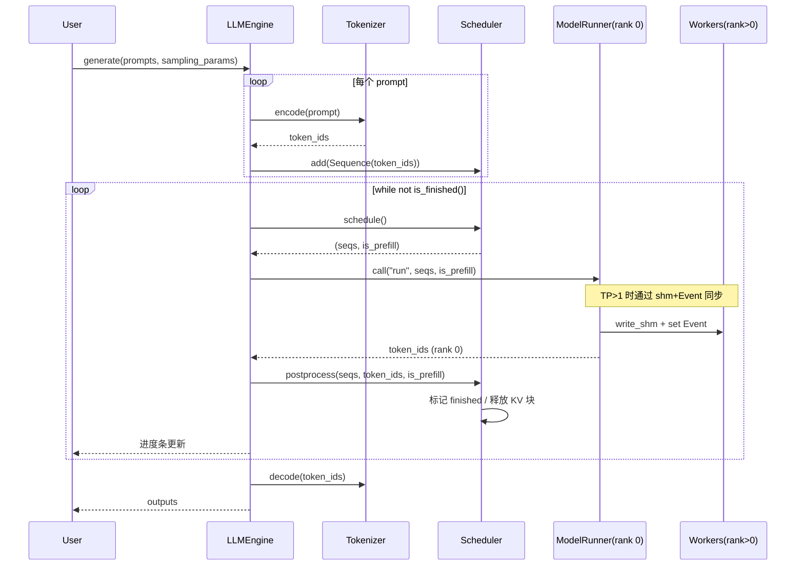
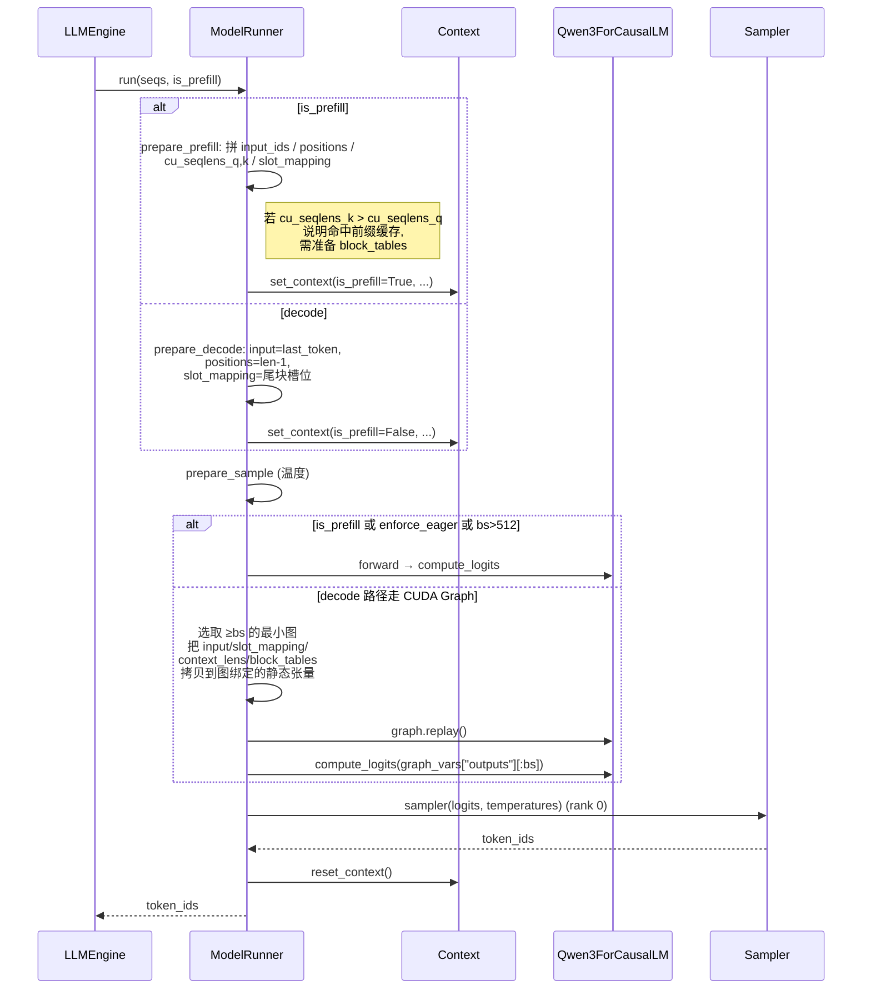
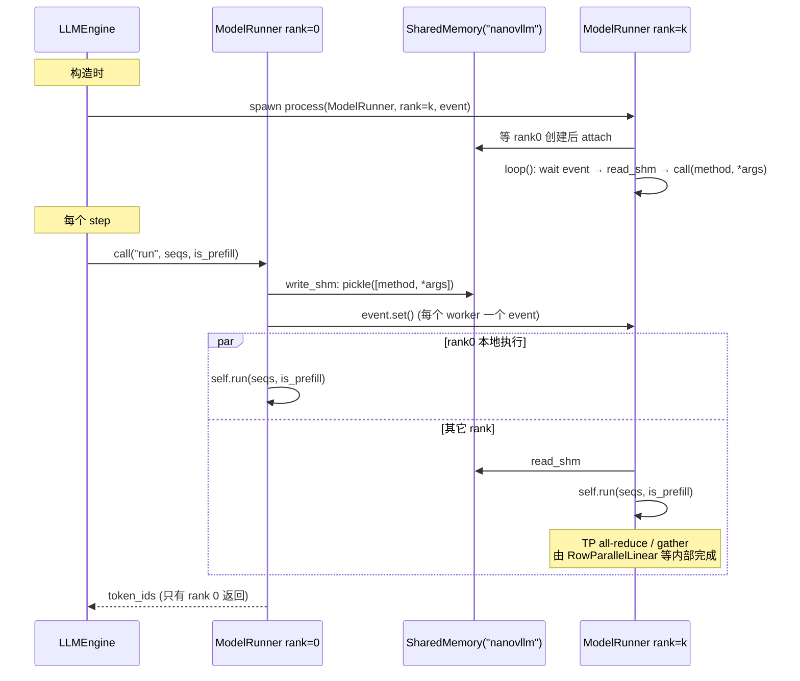

# Nano-vLLM 代码导读

> 一份精简版 vLLM 的源码分析文档，涵盖整体架构、模块职责、关键流程时序图，以及若干性能优化点的实现细节。
>
> 适合：希望系统理解 LLM 推理引擎实现的读者；想了解 PagedAttention / Prefix Cache / Tensor Parallel / CUDA Graph 等优化在工程上如何落地的读者。

---

## 1. 项目概览

Nano-vLLM 是 vLLM 的简化实现，全部源码约 1200 行 Python，但保留了 vLLM 的核心优化能力：

| 优化项 | 实现位置 |
|---|---|
| PagedAttention（块式 KV Cache） | `engine/block_manager.py`, `layers/attention.py` |
| Prefix Caching（前缀缓存） | `engine/block_manager.py` 中的 xxhash 哈希链 |
| Continuous Batching（连续批处理） | `engine/scheduler.py` |
| Chunked Prefill（分块预填充） | `engine/scheduler.py` |
| Preemption（抢占） | `engine/scheduler.py` |
| Tensor Parallelism（张量并行） | `layers/linear.py`, `layers/embed_head.py`, `engine/model_runner.py` |
| CUDA Graph（图捕获 decode） | `engine/model_runner.py` 的 `capture_cudagraph` |
| `torch.compile`（核融合） | `layers/layernorm.py`, `layers/activation.py`, `layers/rotary_embedding.py`, `layers/sampler.py` |
| FlashAttention v2（变长 + KV cache 双模式） | `layers/attention.py` |

入口非常薄：

```python
# nanovllm/llm.py
from nanovllm.engine.llm_engine import LLMEngine
class LLM(LLMEngine):
    pass
```

`LLM(...).generate(prompts, sampling_params)` 即可完成端到端推理。

---

## 2. 目录结构

```
nanovllm/
├── __init__.py                 # 暴露 LLM, SamplingParams
├── llm.py                      # LLM = LLMEngine 别名
├── config.py                   # 全局 Config 数据类
├── sampling_params.py          # 采样参数
├── engine/
│   ├── llm_engine.py           # 顶层引擎：管理 TP 进程、调度、生成循环
│   ├── sequence.py             # 单条请求的数据结构 + 状态机
│   ├── scheduler.py            # 调度器：waiting/running 队列管理
│   ├── block_manager.py        # KV Cache 块分配与前缀缓存
│   └── model_runner.py         # 模型 worker：建模、KV 内存、CUDA 图、TP IPC
├── layers/
│   ├── attention.py            # flash-attn 封装 + Triton 写 KV 内核
│   ├── linear.py               # TP 线性层族（Replicated/Column/Row/QKV/Merged）
│   ├── embed_head.py           # 词表并行 Embedding 与 LM Head
│   ├── layernorm.py            # RMSNorm（含融合 add）
│   ├── rotary_embedding.py     # RoPE
│   ├── activation.py           # SiluAndMul（SwiGLU 用）
│   └── sampler.py              # Gumbel 采样
├── models/
│   └── qwen3.py                # Qwen3ForCausalLM 模型组装
└── utils/
    ├── context.py              # per-step 上下文（slot_mapping、block_tables 等）
    └── loader.py               # safetensors 权重加载 + packed 映射
```

---

## 3. 整体架构

```
┌─────────────────────────────────────────────────────────────┐
│                         LLMEngine                           │
│                                                             │
│  ┌──────────┐   ┌────────────┐   ┌────────────────────────┐│
│  │Tokenizer │   │ Scheduler  │   │ ModelRunner (rank 0)   ││
│  │ (HF)     │   │            │   │  ├─ Qwen3ForCausalLM   ││
│  └──────────┘   │ waiting Q  │   │  ├─ KV Cache 显存池    ││
│                 │ running Q  │   │  ├─ CUDA Graph 池      ││
│                 │            │   │  └─ Sampler            ││
│                 │BlockManager│   └─────────┬──────────────┘│
│                 │ ├ blocks[] │             │ shm + Event   │
│                 │ ├ free_ids │             ▼               │
│                 │ └ hash→id  │   ModelRunner (rank 1..N-1) │
│                 └────────────┘   每个 GPU 一个子进程        │
└─────────────────────────────────────────────────────────────┘
```

请求生命周期：

```
add_request → Scheduler.waiting (WAITING)
                │
                ▼ schedule() prefill
            Scheduler.running (RUNNING)
                │
                ▼ schedule() decode 循环
            遇到 EOS / max_tokens → FINISHED → 释放 KV 块
```

---

## 4. 核心数据结构

### 4.1 `Sequence` —— 一条请求的全部状态

`engine/sequence.py` 定义了请求贯穿生命周期的状态：

```python
class Sequence:
    block_size = 256                # 类变量，构造时由 Config 同步
    counter = count()               # 全局自增 seq_id

    # 关键字段
    seq_id: int
    status: SequenceStatus          # WAITING / RUNNING / FINISHED
    token_ids: list[int]            # 含 prompt + 已生成 token
    last_token: int
    num_tokens: int
    num_prompt_tokens: int
    num_cached_tokens: int          # 已经命中/写入 KV 缓存的 token 数
    num_scheduled_tokens: int       # 当前 step 计划处理的 token 数
    is_prefill: bool                # 是否还在 prefill 阶段
    block_table: list[int]          # 该 seq 占用的物理 KV 块索引
    temperature, max_tokens, ignore_eos
```

特别值得关注的是 `__getstate__`/`__setstate__`：跨进程 pickle 时，**decode 阶段只发送 `last_token`，prefill 阶段才发送完整 `token_ids`**，把 TP 之间的 IPC 流量压到最小。

### 4.2 `Block` 与 `BlockManager` —— PagedAttention 与前缀缓存

`engine/block_manager.py` 的 `Block` 包含：
- `block_id`: 物理块索引
- `ref_count`: 引用计数（多 seq 共享前缀时 >1）
- `hash`: 内容哈希（前缀链式）
- `token_ids`: 该块里实际 token，用于哈希冲突时的内容比对

`BlockManager` 维护：
- `blocks[]`: 全部物理块的元信息
- `free_block_ids` (deque) / `used_block_ids` (set)：自由列表 + 已用集合
- `hash_to_block_id`: 哈希 → 块 id，用作前缀缓存索引

哈希计算是**链式**的（每个块的哈希都把前一个块的哈希作为前缀，从而保证"相同 prefix → 相同 hash 链"）：

```python
@classmethod
def compute_hash(cls, token_ids, prefix=-1):
    h = xxhash.xxh64()
    if prefix != -1: h.update(prefix.to_bytes(8, "little"))
    h.update(np.array(token_ids).tobytes())
    return h.intdigest()
```

注意：**只对"满块"计算哈希**（`hash_blocks` 里 `start..end` 的边界用整数除法切到块边界），未填满的尾块永远 hash=-1，不参与前缀缓存。

### 4.3 `Context` —— per-step 全局上下文

`utils/context.py` 是一个进程级单例，存放本次 forward 需要的元数据：

```python
@dataclass
class Context:
    is_prefill: bool
    cu_seqlens_q, cu_seqlens_k          # FlashAttention 变长前缀和
    max_seqlen_q, max_seqlen_k
    slot_mapping                         # token → KV cache 槽位
    context_lens                         # decode 时每条 seq 的总长度
    block_tables                         # paged attention 块表
```

`ModelRunner.prepare_prefill/prepare_decode` 会调用 `set_context(...)` 写入；模型内部各层通过 `get_context()` 读取——这样模型 forward 签名保持干净（只接受 `input_ids`、`positions`）。

---

## 5. 关键流程时序图

### 5.1 `LLM.generate` 顶层循环



要点：
- `step()` 每次只跑**一种**模式（要么 prefill 要么 decode）。Scheduler 把同种类型的 seq 凑成一个 batch。
- `num_tokens` 用正负号区分 prefill/decode 速率（`llm_engine.py:51`）。

### 5.2 Scheduler.schedule —— Prefill 优先 + Chunked Prefill

```mermaid
flowchart TD
    A[schedule] --> B{有 waiting?}
    B -- 是 --> C[取 waiting[0]]
    C --> D{已分配过 block_table?<br/>chunked prefill 续跑}
    D -- 否 --> E[can_allocate: 检查前缀缓存<br/>+ 自由块够不够]
    D -- 是 --> F[计算剩余 prefill token 数]
    E --> G{够吗?}
    G -- 否 --> H[break, 进 decode]
    G -- 是 --> I[计算 num_tokens]
    F --> I
    I --> J{remaining < num_tokens<br/>且已有人在 batch?}
    J -- 是 --> H
    J -- 否 --> K[allocate / 截断 num_scheduled<br/>= min(num_tokens, remaining)]
    K --> L{prefill 是否一次跑完?}
    L -- 是 --> M[seq → RUNNING, 移出 waiting]
    L -- 否 --> N[保留在 waiting, 下轮继续]
    M --> O[加入 batch]
    N --> O
    O --> B

    H --> P{有 running?}
    P -- 是 --> Q[取 running[0]]
    Q --> R{can_append?}
    R -- 否 --> S[抢占队尾<br/>preempt 释放 KV]
    R -- 是 --> T[may_append 可能新分配 1 块]
    T --> U[scheduled, is_prefill=False]
    U --> P

    P -- 否 --> Z[返回 batch]
```

关键逻辑（`scheduler.py`）：

1. **优先 prefill**：waiting 队列只要有人就先做 prefill。
2. **Chunked prefill**：当一个 prefill seq 太长（`num_tokens > remaining`）但当前 batch 还没人时，允许只 prefill 一部分，剩下的等下一轮。一次只允许"队头一条" chunked。
3. **Decode 阶段抢占**：decode 时若 KV 块不够（`can_append` 失败）就从 running 队尾倒序抢占（释放其 KV、状态置回 WAITING、放回 waiting 队首），直到当前 seq 能 append。
4. **Preempted seq 重新入队时 `is_prefill=True`**：因为它的 KV 已经丢了，下次轮到它会重新走 prefill 流程（此时若前缀仍在缓存里，可命中前缀缓存，不需要重算）。

### 5.3 BlockManager —— 前缀缓存命中流程

```mermaid
sequenceDiagram
    participant S as Scheduler
    participant BM as BlockManager
    participant H as hash_to_block_id

    S->>BM: can_allocate(seq)
    loop 对 seq 的前 N-1 块（满块）
        BM->>BM: h = compute_hash(block_i, h)
        BM->>H: get(h)
        alt 命中 + token_ids 完全相同
            BM->>BM: num_cached_blocks++<br/>若已 used 不算新块
        else 不命中或冲突
            break
        end
    end
    BM-->>S: num_cached_blocks (或 -1 表示空间不足)

    S->>BM: allocate(seq, num_cached_blocks)
    loop 缓存命中部分
        BM->>H: 取 block_id
        BM->>BM: ref_count++ 或 从 free 移到 used
        BM->>BM: seq.block_table.append
    end
    loop 新分配部分
        BM->>BM: _allocate_block (free.popleft)
    end

    Note over S,BM: 后续 model forward 完成
    S->>BM: hash_blocks(seq)
    BM->>BM: 对新填满的块计算哈希并写入 hash_to_block_id
```

要点：
- **token 内容比对**（`self.blocks[block_id].token_ids != token_ids`）防止哈希冲突。
- **`_allocate_block` 中会清掉旧 hash 索引**（`del self.hash_to_block_id[block.hash]`），保证一致性。
- **deallocate 是引用计数式**：只有 `ref_count` 归零才回收物理块；归零的块仍保留 `hash` 与 `token_ids`，是"软回收"，未来还能被前缀缓存命中。
- `can_append` 仅在 `len(seq) % block_size == 1` 时（即 decode 写入恰好溢出旧块时）需要新分配 1 块，平时返回 True。

### 5.4 ModelRunner.run —— Prefill / Decode 张量装配



`prepare_prefill` 中两个细节值得品味：

1. **slot_mapping 处理"半块"**：第一个块从 `start % block_size` 开始写，最后一个块只到 `end - i*block_size`，中间块满写。这样每个 prefill token 都映射到 KV cache 中精确的一个槽位。
2. **是否传 block_tables**：仅当 `cu_seqlens_k[-1] > cu_seqlens_q[-1]`（k 比 q 长，说明 attention 要看到没在本批内的 cached prefix）时才走 paged 模式；否则直接用本批 q/k/v 做 attention，更快。

### 5.5 Tensor Parallel IPC —— rank 0 主导，其它 rank 只读



实现要点（`model_runner.py`）：
- 使用 `torch.multiprocessing.spawn`，每进程绑定一个 GPU（`torch.cuda.set_device(rank)`）。
- 通信走两层：**控制面**（要执行什么方法 + Sequence 对象）→ Python 共享内存 + multiprocessing.Event；**数据面**（forward 内部的 all-reduce / gather）→ NCCL。
- `Sequence.__getstate__` 在 decode 阶段只发 `last_token`，避免重复传送 prompt。
- `ParallelLMHead.forward` 用 `dist.gather` 把分片 logits 收到 rank 0 来采样，只有 rank 0 拿到 token，再下一个 step 时把 token 通过 shm 发给其他 rank。

---

## 6. 模型与算子细节

### 6.1 Qwen3 模型组装（`models/qwen3.py`）

```
Qwen3ForCausalLM
└── model: Qwen3Model
    ├── embed_tokens: VocabParallelEmbedding
    ├── layers: [Qwen3DecoderLayer × N]
    │     ├── input_layernorm: RMSNorm
    │     ├── self_attn: Qwen3Attention
    │     │     ├── qkv_proj: QKVParallelLinear  (col-parallel, 融合 Q/K/V)
    │     │     ├── q_norm, k_norm: RMSNorm     (Qwen3 特色, 仅 qkv_bias=False 分支)
    │     │     ├── rotary_emb: RotaryEmbedding (lru_cache 共享)
    │     │     ├── attn: Attention             (flash-attn + paged KV)
    │     │     └── o_proj: RowParallelLinear    (内部 all-reduce)
    │     ├── post_attention_layernorm: RMSNorm
    │     └── mlp: Qwen3MLP
    │           ├── gate_up_proj: MergedColumnParallelLinear (col-parallel, 融合 gate+up)
    │           ├── act_fn: SiluAndMul
    │           └── down_proj: RowParallelLinear
    └── norm: RMSNorm
└── lm_head: ParallelLMHead   (与 embed 共享权重当 tie_word_embeddings=True)
```

`Qwen3DecoderLayer.forward` 用一个 **`residual` 透传 + 融合 add+RMSNorm** 的小技巧（`layernorm.py` 的 `add_rms_forward`），让残差加法和 RMSNorm 在同一个 `torch.compile` 图里完成。

### 6.2 Attention 双模式（`layers/attention.py`）

写 KV：自定义 Triton 内核 `store_kvcache_kernel`，每个 program 处理一个 token：
- 读取 `slot_mapping[idx]`，==-1 表示"无须写入"（CUDA Graph 时把 padding 的槽设成 -1）；
- 把 `(num_heads * head_dim)` 长度的 K/V 写入 `k_cache/v_cache` 的对应槽位。

读 KV：
- **Prefill**：`flash_attn_varlen_func`（变长 cu_seqlens 形式）；如果 `block_tables is not None`（命中前缀缓存），直接把 `k_cache/v_cache` 当作 KV 源，由 flash-attn 内部根据 `block_table` 间接寻址。
- **Decode**：`flash_attn_with_kvcache`，q 形状 `(bs, 1, h, d)`，K/V 来自 paged cache，`cache_seqlens=context_lens` 指明每条 seq 已生成长度。

### 6.3 张量并行线性层（`layers/linear.py`）

| 类 | 切分维度 | 用途 | forward 通信 |
|---|---|---|---|
| `ReplicatedLinear` | 无 | 不分片 | 无 |
| `ColumnParallelLinear` | 输出维 (dim 0) | Q/K/V proj、gate/up proj | 无（输出本就要继续处理） |
| `MergedColumnParallelLinear` | 输出维 | gate+up 融合 | 无；按 `loaded_shard_id ∈ {0,1}` 分别加载 |
| `QKVParallelLinear` | 输出维 | qkv 融合 | 无；按 `loaded_shard_id ∈ {q,k,v}` 加载 |
| `RowParallelLinear` | 输入维 (dim 1) | o_proj、down_proj | `dist.all_reduce(y)` 完成最后求和 |

通过给每个 `Parameter` 注入 `weight_loader` 方法，加载器（`utils/loader.py`）能拿到具体的 shard_id 信息按需切片，无需为不同层写不同加载逻辑。

### 6.4 词表并行 + LM Head（`layers/embed_head.py`）

`VocabParallelEmbedding`：
- 词表沿 vocab 维等分；
- `forward` 时把不在本 rank 范围内的 token id `mask` 成 0 → `F.embedding` → 对结果 mask → `all_reduce`，使每个 rank 都得到完整 hidden。

`ParallelLMHead`：
- **prefill 时只取每条 seq 的最后一个 token 来算 logits**（用 `cu_seqlens_q[1:] - 1` 索引），节省大量 vocab × hidden 计算；
- TP 时通过 `dist.gather` 把分片 logits 集中到 rank 0，再 `cat` 出完整 logits 用于采样。

### 6.5 采样（`layers/sampler.py`）

```python
sample_tokens = probs.div_(torch.empty_like(probs).exponential_(1).clamp_min_(1e-10)).argmax(dim=-1)
```

**Gumbel-Max 采样的等价形式**：从 `Exp(1)` 生成 g，用 `argmax(p / g)` 即等于按 p 概率多项式采样。`@torch.compile` 把整个采样路径融合掉。

### 6.6 CUDA Graph 捕获（`model_runner.py:capture_cudagraph`）

- 仅 **decode** 路径走图（prefill batch 形状高度可变，不适合）。
- 预定义一组 batch size 桶 `[1,2,4,8,16,32,...,max_bs]`，每个桶各捕获一张图。
- 所有图共享同一组静态张量（`graph_vars`）：`input_ids`、`positions`、`slot_mapping`、`context_lens`、`block_tables`、`outputs`。
- 复用 `graph.pool()` 让多张图共享显存，避免 N 倍占用。
- 运行时：选最小的"≥实际 bs"的桶，把动态张量 copy 进静态张量、`graph.replay()`。

`prepare_decode` 在 `enforce_eager=False` 时实际调用上面 graph 路径前，要：
1. `slot_mapping.fill_(-1)` 然后 `[:bs] = ...`，让多余的 slot 映射到 -1，Triton 内核会跳过这些位置（避免污染他人 KV 槽）；
2. `context_lens.zero_()`，让 flash-attn 把 padding 的 seq 视作长度 0。

---

## 7. KV Cache 显存估算（`model_runner.py:allocate_kv_cache`）

```python
free, total = torch.cuda.mem_get_info()
used = total - free
peak = ...["allocated_bytes.all.peak"]
current = ...["allocated_bytes.all.current"]
block_bytes = 2 * num_layers * block_size * num_kv_heads * head_dim * dtype.itemsize
num_kvcache_blocks = (total * gpu_memory_utilization - used - peak + current) // block_bytes
```

逻辑解读：
- `total * gpu_memory_utilization` 是允许用的上限；
- 已经被其他东西占住的部分：`used + (peak - current)`（peak 反映了 warmup 时一次性需要的临时显存峰值，应当扣掉，避免后续 OOM）；
- 余下空间 / 单块字节数 = 能开多少块。

`block_bytes` 中的 `2` 是 K + V，`num_kv_heads` 已按 TP 分片。所有层共享一块大 buffer：

```python
self.kv_cache = torch.empty(2, num_layers, num_kvcache_blocks, block_size, num_kv_heads, head_dim)
# 把每层的 k_cache / v_cache 视图绑定到对应 Attention 模块
```

各层 `Attention.k_cache/v_cache` 都是该大 tensor 的零拷贝视图，因此 `store_kvcache_kernel` 用全局 `slot_mapping` 索引，就等价于"先选层、再选块、再选块内偏移"。

---

## 8. 性能优化串讲

读完上面再回头串一下，会发现 nano-vllm 的几乎每一行代码都在为延迟/吞吐做优化：

1. **PagedAttention**：KV 以固定 256 token 为粒度分块，避免传统连续 KV 的预分配浪费，让长短不一的请求共存。
2. **Prefix Caching**：相同 prompt 前缀直接复用块，引用计数 + 软回收 + 哈希链 + token 比对四件套，工程上鲁棒。
3. **Continuous Batching**：每个 step 重新选 batch，刚 finish 的请求腾出的空位下一步立即被新请求填上，GPU 不空转。
4. **Chunked Prefill**：避免一个超长 prompt 一次吃满 `max_num_batched_tokens`，让长短请求公平共享。
5. **Preemption**：内存压力下牺牲低优先级 seq 的 KV，保障队头前进；前缀缓存让重启代价可控。
6. **TP**：列并行（QKV/MLP gate-up）+ 行并行（o_proj/down_proj）经典布局，all-reduce 只在 row-parallel 出口；词表并行在 embedding/lm_head；rank 0 主导 + 共享内存广播控制信号。
7. **CUDA Graph**：decode 阶段消除 host overhead，桶式批大小 + slot_mapping=-1 的 padding 处理。
8. **`torch.compile`**：sampler / RMSNorm / RoPE / SwiGLU 等小算子全部图融合。
9. **FlashAttention**：prefill 走 varlen，decode 走 with_kvcache + paged block table，二者共用同一份 KV cache 内存。
10. **细节**：`pin_memory=True, non_blocking=True` 的 H2D 拷贝；`Sequence.__getstate__` 在 decode 时只传 last_token；`get_rope` 用 `lru_cache` 全局共享 cos/sin 表。

---

## 9. 想动手改？建议的切入点

- 想加新模型：参考 `models/qwen3.py`，套用 `layers/*` 中的 TP 算子，实现 `forward` 与 `compute_logits`，并在 `Qwen3ForCausalLM.packed_modules_mapping` 同位置声明合并/拆分映射。
- 想加新采样策略（top-p / top-k / repetition penalty）：扩展 `SamplingParams` 与 `layers/sampler.py`，注意 `@torch.compile` 下别用 Python 控制流。
- 想加 LoRA / Speculative Decoding：核心改动在 `model_runner.py`（运行循环）+ `attention.py`（双 KV）+ `scheduler.py`（draft/target 协同）。
- 想做更激进的内存管理：`block_manager.py` 是入口，可考虑 swap / disk offload / 时间局部性调度等。
- 想看清一个 step 实际在跑什么：在 `model_runner.run` 入口打印 `[seq.seq_id, seq.num_cached_tokens, seq.num_scheduled_tokens for seq in seqs]`，再配合 Scheduler 的 `waiting/running` 长度，能很直观地观察前缀缓存命中、抢占、chunked prefill 行为。

---

## 10. 阅读顺序推荐

1. `example.py` → `nanovllm/llm.py` → `nanovllm/__init__.py`：知道入口长什么样。
2. `engine/llm_engine.py`：抓住主循环 `add_request → step → postprocess`。
3. `engine/sequence.py` + `engine/scheduler.py` + `engine/block_manager.py`：把"请求生命周期"和"KV 块账本"两件事完全搞清楚。
4. `utils/context.py`：理解为什么模型 forward 那么干净。
5. `engine/model_runner.py`：装配 prefill/decode 张量、CUDA graph、TP IPC。
6. `layers/attention.py` + `layers/linear.py` + `layers/embed_head.py`：看具体算子如何吃 Context。
7. `models/qwen3.py`：把上面所有模块组装成一个 LLM。
8. `utils/loader.py`：最后看权重如何对应到融合后的参数张量。

读完一遍后，再读一遍 `scheduler.py` 与 `block_manager.py`，会理解很多看似不起眼的小判断（比如 `can_append` 的 `(len(seq) % block_size == 1)`、`hash_blocks` 里的 `start == end: return`）背后的精准考量。
